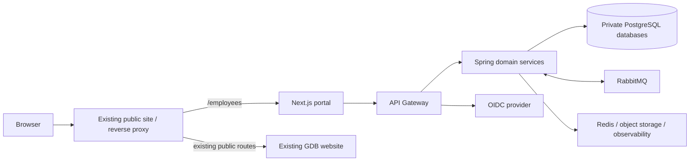
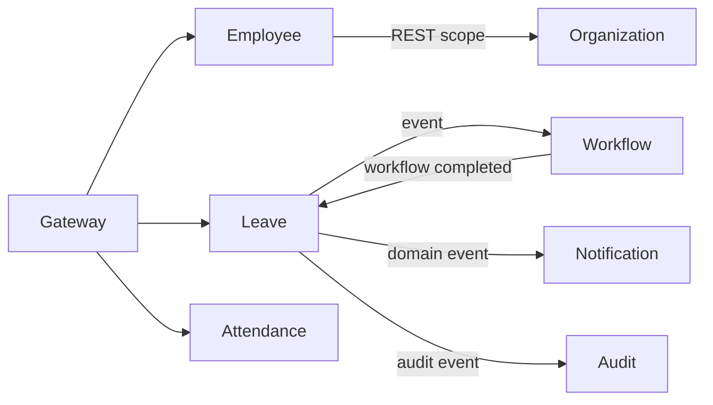
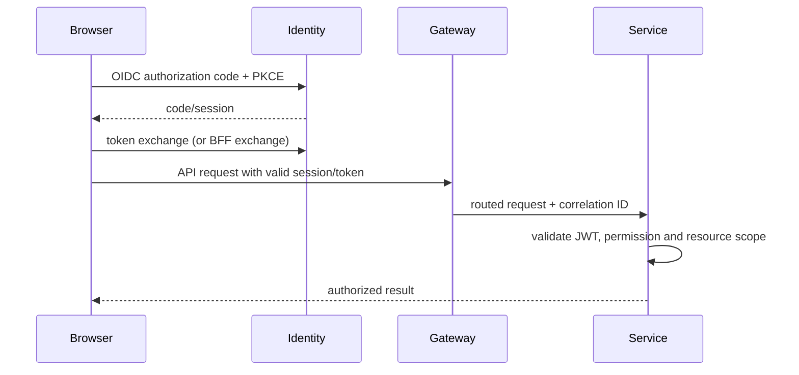
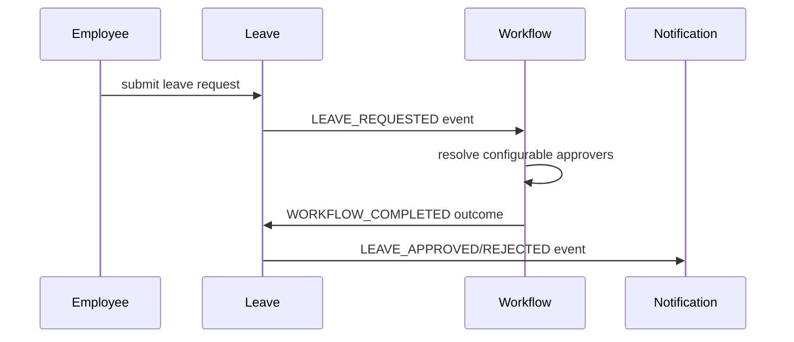
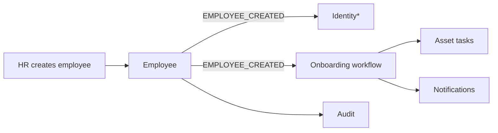
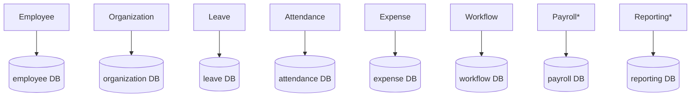

# Architecture

## Goals and constraints

The employee portal must be introduced at `/employees` without disrupting the existing public GDB website. It requires a responsive Next.js/TypeScript frontend, Java 21/Spring Boot 3 services, PostgreSQL, Redis, RabbitMQ, Docker, and an OAuth2/OIDC-compatible security model. Kubernetes is intentionally not an initial requirement.

## Target topology

```text
Browser -> existing GDB web routing (/employees) -> Next.js employee portal
                                              -> API Gateway -> domain services
                                                                  | REST (bounded, synchronous)
                                                                  | RabbitMQ (domain events)
                                                                  + private PostgreSQL database per service
Shared platform: OIDC issuer, RabbitMQ, Redis, object storage, observability stack
```

The public site's `/employees` routing must be verified with the current hosting/runtime owner before integration. The frontend may be reverse-proxied or deployed as a separate application behind that path; the existing public application is never modified without a compatibility and rollback plan.

## Architectural decisions

- Use domain-oriented services, not one service per screen or CRUD table.
- Keep service data private; cross-domain views are built from APIs, events, or a reporting read model.
- REST is used where a caller needs an immediate authoritative result. RabbitMQ distributes facts that have already committed.
- Every mutation is authenticated, authorized by the receiving service, audited, and emits an outbox record when it has an integration consequence.
- Deploy containers with Docker Compose locally and a production container platform initially. Kubernetes is a later operational choice, not a starting dependency.

## Assumptions to validate

- GDB's existing site hosting, routing, TLS termination, and authentication integration are unknown.
- Payroll jurisdiction, tax rules, pay schedules, and external payroll provider are unspecified; payroll calculation is out of scope until supplied.
- Organizational hierarchy, leave policies, attendance source devices, and document retention rules need business ownership before implementation.
- Object-storage provider and OIDC identity-provider choice have not been specified.

## Diagrams

### System and deployment boundary



### Service communication



### Authentication flow



### Leave approval and onboarding





### Database ownership



## `/employees` coexistence design

The public website continues to own all existing paths. At the existing edge/reverse proxy, route only `/employees` and `/employees/_next/*` (or the selected framework asset base path) to the independently deployed Next.js portal, and route `/api/v1/*` to the gateway under the same HTTPS origin where possible. This avoids browser CORS for normal portal traffic; if separate origins are required, CORS must allow only exact portal origins. The portal authenticates through the selected OIDC issuer/callback paths, never through an unverified public-site session.

Portal deployments, static assets/cache policy, health checks, rollback and access logs are separate from the public website. Before implementation GDB must confirm existing hosting/proxy technology, path rewrite/collision behavior, CDN cache rules, TLS/certificate owner, available subpaths, OIDC callback URLs, deployment ownership, and rollback method. No public-site route, asset, or authentication configuration is changed until these are confirmed and tested in staging.
